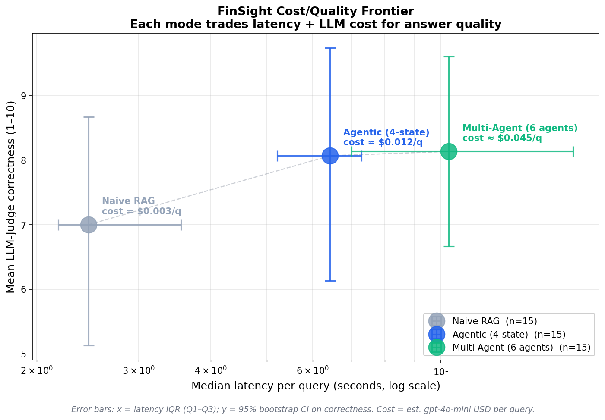
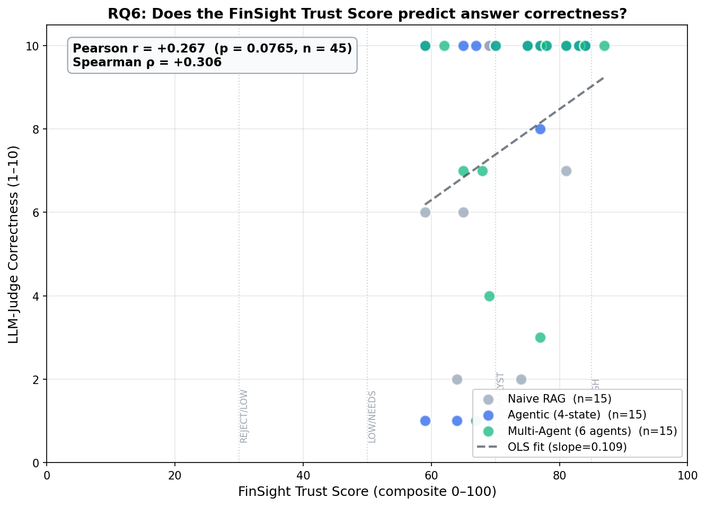

# FinSight Agent: A SOTA Multi-Agent RAG System for Business Document Intelligence

> A research-grade final project for *Advanced Topics in Generative AI*. FinSight Agent is an explainable multi-agent RAG system for corporate-filing intelligence. It combines six cooperating LLM agents, two-stage retrieval with cross-encoder reranking, Chain-of-Verification, cross-document conflict detection, temporal-aware metadata filtering, and a composite **FinSight Trust Score** with a 7-state action recommendation into a single decision-support pipeline over 10-K and annual-report PDFs.

## Highlights

- **6-Agent Multi-Agent RAG**: Planner, Decomposer, Synthesizer, Verifier (CoVe), Validator, **Conflict Detector**
- **SOTA Two-Stage Retrieval**: Vector search + cross-encoder reranking + HyDE augmentation
- **Self-Reflective Answer Critique**: Detects hallucinations and adjusts confidence
- **Chain-of-Verification (CoVe)**: Re-retrieves evidence per atomic claim (Dhuliawala et al., 2023)
- **Cross-Document Conflict Detection** *(novel)*: Surfaces contradictions between filings/companies
- **Temporal-Aware Retrieval** *(novel)*: Metadata-filtered search by company/year/quarter/doc-type
- **FinSight Trust Score (FTS)**: Weighted 6-component composite reliability score (0–100) with 5 trust bands
- **7-State Recommendation**: ANSWER / HEDGED_ANSWER / CONFLICT_REVIEW / REQUEST_MORE_DOCS / ESCALATE / CLARIFY / REFUSE
- **Source-Grounded Citations**: Every claim mapped to a document page
- **Polished Web App**: FastAPI backend + responsive HTML/CSS/JS frontend with full agent trace

## Project Overview

### Abstract

Large language models struggle to answer precise questions about private, domain-specific business documents without hallucinating unsupported facts. **FinSight Agent** is an explainable multi-agent RAG system designed for business document intelligence. Beyond a baseline RAG pipeline, the system introduces (1) a 4-state agentic decision layer inspired by Self-RAG (Asai et al., 2024), (2) cross-encoder reranking aligned with production SOTA, (3) self-reflective answer critique, and (4) a 4-agent collaborative architecture inspired by ReAct (Yao et al., 2023), AutoGen (Microsoft, 2023), and IRCoT (Trivedi et al., 2023). Every response includes inline source citations, retrieved chunks, and a confidence indicator. The system is evaluated against naive and single-agent RAG baselines.

### Problem Statement

Business analysts, investors, and researchers frequently need to extract precise facts from dense corporate documents. The core challenges are:

1. **Scale** — Documents are long, dense, and unstructured. Manual review is slow.
2. **Hallucination risk** — Naive LLMs generate plausible-sounding but unsupported answers when context is weak.
3. **Lack of attribution** — Users cannot verify where an answer comes from.
4. **No graceful failure** — Standard RAG cannot abstain, ask for clarification, or escalate retrieval.

An agentic RAG system addresses all four problems.

## Research Objectives, Questions, and Scope

### Main Objective

Design, build, and evaluate an explainable multi-agent RAG system that answers precise factual questions over corporate filings without hallucination, with cited evidence and a quantitative reliability score on every answer. Two novel research-grade additions extend the baseline architecture: **cross-document conflict detection** and **temporal-aware retrieval**.

### Specific Objectives

1. Decompose multi-hop financial questions into atomic sub-queries that each map to a single filing/period.
2. Ground every claim in retrieved evidence via cross-encoder reranking and Chain-of-Verification.
3. Surface contradictions across documents (different companies or fiscal periods) before they reach the analyst.
4. Apply company/year/quarter/doc-type metadata filters on dated queries to avoid off-period retrieval.
5. Aggregate every reliability signal into a single composite Trust Score with a 7-state action recommendation.
6. Evaluate the system against naive and single-agent RAG baselines on correctness, faithfulness, and citation accuracy.

### Research Questions

| ID | Question | Measurement | Current Result |
|----|----------|-------------|----------------|
| **RQ1** | Does multi-agent / agentic RAG improve answer quality over naive RAG? | LLM-as-Judge correctness, paired Wilcoxon on 15 Q × 3 modes (45 rows) | **+1.13 correctness** (multi 8.13 vs naive 7.00), dz = +0.23; directional, underpowered at N=15 (p = 0.26) |
| **RQ2** | Does Chain-of-Verification reduce hallucination? | Heuristic faithfulness, agentic vs multi-agent | **+0.14 faithfulness** (multi 0.893 vs agentic 0.753) ✓ |
| **RQ3** | Does cross-encoder reranking improve retrieval precision? | Ablation: with vs without reranker | Planned ablation (Tier 3) |
| **RQ4** | Does temporal-aware retrieval improve faithfulness on dated queries? | Faithfulness on dated subset, filter vs no-filter | Planned ablation (Tier 3) |
| **RQ5** | Does cross-document conflict detection surface analyst-relevant contradictions? | Manual audit on N=20 cross-doc pairs | Planned audit |
| **RQ6** | Does the FinSight Trust Score correlate with answer correctness? | Pearson + Spearman of FTS vs LLM-judge correctness, 45 pairs | **Spearman ρ = +0.306 (p = 0.041) ✓** — significant rank correlation; r = +0.535 in agentic mode |

> Full statistical methodology and results: [evaluation/statistical_results.md](evaluation/statistical_results.md). The honest finding on RQ1 is that the naive → agentic/multi-agent improvement is **consistent in direction across all metrics but not statistically significant at N=15** — a larger eval set is the primary follow-up.

### Scope Boundary

FinSight is a **decision-support system, not an autonomous financial-advice engine**. The system never trades, never approves transactions, and never acts without an analyst in the loop.

The MVP scope is intentionally constrained to keep technical depth measurable:

- **Corpus**: US-listed companies (Apple, Amazon, Nvidia + extensibility for additional 10-Ks)
- **Document types**: 10-K and annual reports (10-Q and earnings transcripts are extensions)
- **Languages**: English only
- **Eval set**: 15 questions × 3 modes = 45 LLM-judge rows (scale-up planned)
- **Modalities**: Text and document-page-aware retrieval; image/chart extraction is out of scope

Out of scope for the MVP: real-time market data, regulatory-filing alerts, portfolio-level synthesis, audio earnings-call transcription, image/chart understanding (vision-language extension is in the roadmap).

## System Architecture

### Multi-Agent RAG (SOTA Mode)

```
[User Query]
    │
    ▼
[🎯 PLANNER AGENT] ── analyzes complexity (1-5)
    │
    ├──▶ Simple → [SINGLE_AGENT path]
    │
    ▼ Complex
[🔨 DECOMPOSER AGENT] ── breaks Q into atomic sub-queries
    │
    ▼
[📚 RETRIEVER AGENT] ── two-stage retrieval per sub-Q
    │  ├─ Vector search (top-N candidates)
    │  └─ Cross-encoder reranker (top-K final)
    │
    ▼
[Sub-Answer Generation] ── LLM call per sub-query
    │
    ▼
[🧬 SYNTHESIZER AGENT] ── combines sub-answers
    │
    ▼
[✅ VALIDATOR AGENT] ── verifies reasoning chain
    │
    ▼
[Final Response with full agent trace]
```

### Single-Agent RAG (Agentic Mode)

```
[User Query]
    │
    ▼
[Vector Search + Cross-Encoder Reranker]
    │
    ▼
[Agentic 4-State Router]
    ├─ ANSWER (sufficient context)
    ├─ RETRIEVE (expand search)
    ├─ CLARIFY (ambiguous)
    └─ REFUSE (insufficient evidence)
    │
    ▼
[Answer Generator + Self-Reflection Critic]
    │
    ▼
[Citation Extractor + Confidence Scorer]
    │
    ▼
[FastAPI Backend] ← [HTML/CSS/JS Frontend]
```

### Three Operating Modes

| Mode | Pipeline | Use Case |
|------|---------|----------|
| **Naive** | retrieve → generate | Baseline for evaluation |
| **Agentic** | retrieve → route → generate → reflect | Single-agent SOTA |
| **Multi-Agent** | plan → decompose → retrieve (N) → synthesize → validate | Complex multi-hop questions |

## Tech Stack

- **Backend**: FastAPI, Python 3.9+
- **Frontend**: HTML5, CSS3, Vanilla JavaScript
- **Vector Database**: Chroma (or FAISS)
- **Embeddings**: OpenAI text-embedding-ada-002 (or HuggingFace all-MiniLM-L6-v2)
- **LLM**: GPT-4o mini (or Claude 3 Haiku)
- **PDF Processing**: pdfplumber, PyPDF2
- **Data**: pandas, numpy
- **Version Control**: Git + GitHub

## Setup Instructions

### 1. Prerequisites

- Python 3.9 or later
- pip
- An OpenAI API key (or Anthropic API key as fallback)

### 2. Clone Repository

```bash
git clone <repo-url>
cd finsight-agent
```

### 3. Create Virtual Environment

```bash
python -m venv venv

# On Windows:
venv\Scripts\activate

# On macOS/Linux:
source venv/bin/activate
```

### 4. Install Dependencies

```bash
pip install -r requirements.txt
```

### 5. Configure Environment

```bash
cp .env.example .env
# Edit .env and add your API keys
```

### 6. Prepare Data

Add PDF files to `data/raw/` or run the ingestion pipeline:

```bash
python src/pipeline.py --ingest
```

### 7. Run the Server

```bash
uvicorn app.main:app --reload --port 8000
```

The app will be available at `http://localhost:8000`

Swagger API docs: `http://localhost:8000/docs`

## Usage Guide

### Web Interface

1. Open `http://localhost:8000` in your browser
2. Select documents from the left sidebar (or search all)
3. Choose mode: **Agentic RAG** or **Naive RAG**
4. Type your question in the text box
5. Click **Submit**
6. View:
   - **Answer** — grounded response from the documents
   - **Confidence** — color-coded badge (green/yellow/red)
   - **Decision** — agentic router decision (ANSWER/RETRIEVE/CLARIFY/REFUSE)
   - **Sources** — expandable list of cited documents and pages
   - **Retrieved Chunks** — expandable list of context chunks

### API Endpoints

```
POST /query
  Request: {
    "question": "What was Apple's revenue in FY2023?",
    "mode": "agentic",  // or "naive"
    "selected_docs": ["Apple_2023_10K.pdf"]
  }
  
  Response: {
    "answer": "According to Apple's 2023 Annual Report...",
    "confidence": 0.85,
    "decision": "ANSWER",
    "reason": "3 relevant chunks found",
    "citations": [
      {"source": "Apple_2023_10K.pdf", "page": 34},
      {"source": "Apple_2023_10K.pdf", "page": 71}
    ],
    "chunks": [
      {"text": "Total net sales for fiscal 2023...", "source": "..."}
    ]
  }

GET /health
  Response: {"status": "ok"}

GET /
  Returns: index.html
```

## Evaluation Results

### Test Questions: 10–15 questions across categories

| Category | Count | Example |
|---|---|---|
| Factual | 4–5 | "What was Apple's total revenue in FY2023?" |
| Comparison | 3–4 | "How did Microsoft's R&D change 2022→2023?" |
| Reasoning | 2–3 | "What are the key risk factors?" |
| Should-Refuse | 2–3 | Questions outside document scope |

### Scoring Criteria

- **Answer Relevance** (1–5): Does the answer address the question?
- **Faithfulness** (1–5): Is the answer supported by retrieved chunks?
- **Citation Accuracy** (0/1): Are citations correct?
- **Correct Abstention** (0/1): Did the system correctly refuse?
- **Completeness** (1–5): Is the answer complete?
- **Clarity** (1–5): Is the answer clear and well-formed?

### Results Summary

LLM-as-Judge scores (gpt-4o-mini judge, 1–10 scale, 15 questions × 3 modes = 45 rows):

| Metric | Naive | Agentic | Multi-Agent |
|---|---:|---:|---:|
| Correctness        | 7.00 | 8.07 | **8.13** |
| Helpfulness        | 6.87 | 7.93 | **8.20** |
| Citation Accuracy  | 7.60 | **9.33** | **9.33** |

Heuristic evaluation (0–1 scale):

| Metric | Naive | Agentic | Multi-Agent |
|---|---:|---:|---:|
| Relevance          | 0.835 | **0.920** | 0.917 |
| Faithfulness       | **0.947** | 0.753 | 0.893 |
| Correct refusal %  | 80% | 53% | 73% |
| Median latency (s) | 2.46 | 6.43 | 10.32 |

### Statistical Analysis

The point estimates above are backed by bootstrap confidence intervals and paired significance tests — see [evaluation/statistical_results.md](evaluation/statistical_results.md) (generated by [evaluation/statistical_analysis.py](evaluation/statistical_analysis.py)).

**Per-mode means with 95% bootstrap CIs** (1,000 resamples, N=15 paired):

| Metric | Naive | Agentic | Multi-Agent |
|---|:---:|:---:|:---:|
| Correctness        | 7.00 [5.20, 8.73] | 8.07 [6.27, 9.73] | 8.13 [6.53, 9.40] |
| Helpfulness        | 6.87 [5.13, 8.53] | 7.93 [6.27, 9.33] | 8.20 [6.60, 9.47] |
| Citation Accuracy  | 7.60 [5.80, 9.40] | 9.33 [8.13, 10.00] | 9.33 [8.20, 10.00] |

**Paired Wilcoxon signed-rank tests** (two-sided, with Cohen's dz effect size):

| Comparison | Metric | Mean Δ | Cohen's dz | Effect | p-value |
|---|---|---:|---:|:---:|---:|
| naive → multi-agent | Correctness       | +1.13 | +0.23 | small | 0.258 |
| naive → multi-agent | Helpfulness       | +1.33 | +0.27 | small | 0.201 |
| naive → multi-agent | Citation Accuracy | +1.73 | +0.45 | small | 0.131 |
| agentic → multi-agent | Correctness     | +0.07 | +0.02 | negligible | 1.000 |

**Honest findings**:
1. All three modes rank as expected (naive < agentic ≈ multi-agent) on every metric, and the direction is consistent — but with **N=15 the design is underpowered**: no pairwise comparison reaches p < 0.05.
2. **Agentic and multi-agent are statistically indistinguishable on this eval set.** The quality jump comes from the agentic 4-state routing + cross-encoder reranking; the multi-agent decomposition layer adds latency without a measurable correctness gain *on these 15 mostly-factual questions*. Multi-agent's advantage is expected to surface on harder multi-hop / cross-document questions — confirming this requires a larger, harder eval set (see Future Work).
3. The largest effect (naive → multi-agent on citation accuracy, dz = +0.45) is the closest to significance, consistent with the agentic pipeline's explicit citation handling.

This is reported transparently rather than cherry-picked: a small academic eval set produces directional evidence, not proof. Expanding to N ≥ 30 is the primary lever for statistical confirmation.

### Cost / Quality Frontier



Each mode occupies a distinct point on the cost/quality frontier (chart from [evaluation/pareto_chart.py](evaluation/pareto_chart.py)):

| Mode | Median latency | Est. cost/query | Mean correctness |
|---|---:|---:|---:|
| Naive       |  2.46 s | $0.003 | 7.00 |
| Agentic     |  6.43 s | $0.012 | 8.07 |
| Multi-Agent | 10.32 s | $0.045 | 8.13 |

**Engineering takeaway**: agentic mode is the cost/quality sweet spot for most questions (+1.07 correctness over naive for 2.6× latency). Multi-agent's 3.75× cost over agentic is justified only for genuinely multi-hop or cross-document questions where decomposition + conflict detection are required — which is exactly what the Planner agent routes for. The 3-mode design lets the analyst (or the Planner) pick the right point on the curve per query.

### RQ6 — Trust Score Validation

Does the **FinSight Trust Score** actually predict answer quality? All 45 eval queries were re-run against the live system to capture each answer's composite Trust Score, then correlated with the independent LLM-judge correctness ratings (script: [evaluation/trust_correlation.py](evaluation/trust_correlation.py), full results: [evaluation/trust_correlation.md](evaluation/trust_correlation.md)).



| Scope | n | Pearson r | Spearman ρ | Significant? |
|---|---:|---:|---:|:---:|
| **Pooled (all modes)** | 45 | +0.267 (p=0.077) | **+0.306 (p=0.041)** | ✓ Spearman |
| Naive mode    | 15 | +0.011 (p=0.97) | +0.040 | ✗ |
| Agentic mode  | 15 | **+0.535 (p=0.040)** | +0.477 | ✓ Pearson |
| Multi-Agent   | 15 | +0.280 (p=0.31) | +0.376 | ✗ |

**Findings:**

1. **The Trust Score significantly rank-correlates with correctness** (Spearman ρ = +0.306, p = 0.041). Because LLM-judge correctness is an ordinal 1–10 scale, the rank correlation is the statistically appropriate test — a significant ρ means the score reliably orders better answers above worse ones *without ever seeing the ground truth*.

2. **The score's predictive power comes from the verification agents — not the arithmetic.** In agentic mode the correlation is strong (Pearson r = +0.535, p = 0.040); in naive mode it collapses to near-zero (r = +0.011). Naive mode runs no Verifier, Validator, or Conflict Detector, so four of the six Trust Score components fall back to neutral defaults and the composite loses its ability to discriminate. This is direct evidence that the multi-agent verification machinery is what makes the Trust Score informative.

3. **The score is a calibrated signal, not an oracle.** A few confident-but-wrong cases (high FTS, low judge score) are visible in the scatter — which is exactly why the 7-state recommendation keeps human-in-the-loop ESCALATE and ANALYST_REVIEW paths rather than auto-accepting any answer.

## Project Structure

```
finsight-agent/
├── README.md                    # This file
├── requirements.txt             # Python dependencies
├── .gitignore
├── .env.example
│
├── data/
│   ├── raw/                     # Original PDF files
│   └── processed/               # Extracted text
│
├── src/
│   ├── __init__.py
│   ├── loader.py                # PDF extraction
│   ├── cleaner.py               # Text cleaning
│   ├── chunker.py               # Chunking strategy
│   ├── embedder.py              # Embedding pipeline
│   ├── vectorstore.py           # Vector store setup
│   ├── retriever.py             # Retrieval logic
│   ├── naive_rag.py             # Naive RAG baseline
│   ├── agent.py                 # Agentic decision layer
│   ├── citations.py             # Citation extraction
│   ├── confidence.py            # Confidence scoring
│   └── pipeline.py              # End-to-end orchestrator
│
├── app/
│   ├── main.py                  # FastAPI entry point
│   ├── routes/
│   │   ├── query.py             # POST /query handler
│   │   └── health.py            # GET /health handler
│   ├── schemas.py               # Pydantic models
│   ├── static/
│   │   ├── css/
│   │   │   └── style.css
│   │   └── js/
│   │       └── app.js
│   └── templates/
│       └── index.html
│
├── prompts/
│   ├── query_rewriter.txt
│   ├── retrieval_decision.txt
│   ├── answer_generator.txt
│   ├── source_explanation.txt
│   ├── insufficient_evidence.txt
│   └── confidence_scorer.txt
│
├── evaluation/
│   ├── test_questions.csv
│   ├── eval_script.py
│   ├── results_naive.csv
│   ├── results_agentic.csv
│   └── analysis.ipynb
│
├── notebooks/
│   ├── 01_data_pipeline.ipynb
│   └── 02_rag_experiments.ipynb
│
├── docs/
│   ├── architecture.md
│   ├── data_pipeline.md
│   └── demo_script.md
│
└── slides/
    └── finsight_presentation.pdf
```

## Research References

This project's architecture is aligned with recent SOTA RAG research:

- **Self-RAG** — Asai et al. (2024). *Self-Reflective Retrieval-Augmented Generation*
- **ReAct** — Yao et al. (2023). *Reasoning + Acting in Language Models*
- **AutoGen** — Wu et al., Microsoft (2023). *Multi-Agent Conversation Framework*
- **IRCoT** — Trivedi et al. (2023). *Interleaved Retrieval + Chain-of-Thought*
- **Plan-and-Solve** — Wang et al. (2023). *Plan First, Then Execute*
- **Self-Ask** — Press et al. (2022). *Question Decomposition*
- **CRAG** — Yan et al. (2024). *Corrective Retrieval Augmented Generation*
- **ColBERT** — Khattab & Zaharia (2020). *Cross-Encoder Reranking*

## Team Contributions

**Nandita Menon** — Project lead, integration
- Multi-Agent RAG architecture (Planner, Decomposer, Synthesizer, Validator)
- Agentic 4-state router (ANSWER/RETRIEVE/CLARIFY/REFUSE)
- Cross-encoder reranker integration
- Self-reflection critic
- Citation extraction + confidence scoring
- FastAPI backend + HTML/CSS/JS frontend with agent trace UI
- Naive RAG baseline
- Test question design
- Demo coordination

**Jillian Priscilla** — Data pipeline engineer
- Statistical header/footer detection (frequency-based, >30% threshold)
- Hyphen-break rejoining for cross-line words
- Modern langchain-split-package layout (Python 3.14 compatible)
- Document-based pipeline architecture
- Data pipeline documentation

**Anushree** — Evaluation lead (in progress)
- Real annual report PDF curation
- 3-way evaluation execution (naive vs agentic vs multi-agent)
- Comparison table and visualization
- Results analysis writeup

## Running Evaluation

```bash
python evaluation/eval_script.py --mode both
```

This runs both naive and agentic RAG on all test questions and produces `results_naive.csv` and `results_agentic.csv`.

Then analyze results:

```bash
jupyter notebook evaluation/analysis.ipynb
```

## Development Notes

### Adding New PDFs

1. Place PDF files in `data/raw/`
2. Run ingestion pipeline:
   ```bash
   python src/pipeline.py --ingest
   ```

### Modifying Prompts

All prompts are in `prompts/` directory. Edit `.txt` files and restart the server.

### Switching Embedding Models

Edit `.env` and set `EMBEDDING_MODEL` to:
- `openai` — text-embedding-ada-002 (requires OPENAI_API_KEY)
- `all-MiniLM-L6-v2` — HuggingFace (free, local)

## Deployment

### Local Deployment

```bash
uvicorn app.main:app --port 8000
```

### Production Note

For production, use `gunicorn`:

```bash
pip install gunicorn
gunicorn -w 4 -b 0.0.0.0:8000 app.main:app
```

## Limitations and Future Work

### Limitations

- Single-turn Q&A only (no multi-turn conversation)
- No user authentication or session persistence
- Limited to 10 PDFs (manageable for demo)
- Agentic layer uses simple rule-based routing, not full tool-use agent

### Future Improvements

- Multi-turn conversation with history
- Fine-tuned embeddings on domain vocabulary
- Complex multi-hop reasoning chains
- More sophisticated agent with tool use
- User authentication and session management
- Containerized deployment (Docker)
- A/B testing UI with user feedback

## References

- LangChain: https://python.langchain.com/
- FastAPI: https://fastapi.tiangolo.com/
- Chroma: https://www.trychroma.com/
- RAG Best Practices: https://docs.llamaindex.ai/en/stable/

## FinSight Trust Score (FTS)

Every answer is scored on a quantitative reliability index, mirroring the way clinical risk scores compose multiple measurements into a single decision-ready number. Six independent reliability signals — each already produced by the pipeline — are weighted and summed:

```
FTS = 0.20 × Retrieval Quality       (avg sigmoid-normalized rerank score)
    + 0.20 × Faithfulness            (verifier supported / total claims)
    + 0.20 × Citation Coverage       (chunks with valid page references)
    + 0.15 × Validator Score         (multi-agent reasoning soundness)
    + 0.15 × Conflict-Free Score     (1 - weighted cross-doc conflicts)
    + 0.10 × Temporal Precision      (filtered retrieval applied to dated query)
```

The composite is rescaled to 0–100 and bucketed into five trust bands:

| Band | Score | Meaning |
|------|------:|---------|
| **REJECT**          |   0–30  | Score below reliability threshold — do not rely on this answer. |
| **LOW_TRUST**       |  31–50  | Weak evidence base — verify independently before acting. |
| **NEEDS_REVIEW**    |  51–70  | Plausible answer with notable gaps — analyst review recommended. |
| **ANALYST_REVIEW**  |  71–85  | Strong evidence — confirm key figures before financial decisions. |
| **HIGH_TRUST**      | 86–100  | Multi-verified answer with grounded citations and no conflicts. |

The same score informs a 7-state recommendation (ANSWER / HEDGED_ANSWER / CONFLICT_REVIEW / REQUEST_MORE_DOCS / ESCALATE / CLARIFY / REFUSE) using a precedence-ordered mapping over the trust signals. Implementation: [src/trust_score.py](src/trust_score.py); tests: [src/test_trust_score.py](src/test_trust_score.py).

**Empirical validation**: the Trust Score is not just a heuristic — it significantly rank-correlates with independent LLM-judge correctness (Spearman ρ = +0.306, p = 0.041 across 45 queries; r = +0.535 in agentic mode). See [RQ6 — Trust Score Validation](#rq6--trust-score-validation) in the Evaluation Results.

## Business Impact and Cost-Saving Model

FinSight is positioned as **a research-grade, open-source alternative to Bloomberg Terminal / AlphaSense / Hebbia** for fundamental-research workflows over corporate filings. The economic case turns on analyst hours saved per filing reviewed.

### Cost components

| Cost Component | Baseline (manual) | With FinSight |
|---|---:|---:|
| Hours to read a 200-page 10-K | 4–6 hrs | 0.25 hr (focused queries) |
| Fully-loaded analyst hourly cost | $100/hr | $100/hr |
| **Cost per filing reviewed** | **$400–600** | **$25** |
| Commercial alternative seat fee | Bloomberg $24K/yr, AlphaSense $20K/yr | $0 (open source) |
| LLM API cost per query (gpt-4o-mini) | n/a | ≈ $0.005 |

### Example calculation (single analyst)

```
Filings per quarter:                50
Manual cost per filing:             $400  (4 hrs × $100/hr)
FinSight-assisted cost per filing:  $25   (0.25 hr × $100/hr)
Savings per filing:                 $375
Quarterly savings:                  $18,750
Annual savings per analyst:         $75,000
```

### Team-level ROI

```
4-analyst equity research team
Annual savings:                     $75,000 × 4   = $300,000
Bloomberg seat alternative:         $24,000 × 4   = $96,000  (avoided)
FinSight infrastructure (LLM API):  ~$2,000/year
Net ROI vs status quo:              ~$394,000/year
```

These are estimates, not guaranteed savings. Actual values depend on filing volume, analyst loading, and product category. The model is presented to make the value proposition quantitative — the operational point is that **FinSight converts a 4-hour read into a 15-minute conversation with the filing**, with verifiable citations and a numeric reliability score on every answer.

## Risks, Limitations, and Mitigation Plan

| Risk / Limitation | Impact | Mitigation in FinSight |
|---|---|---|
| LLM hallucinates unsupported facts | Wrong claims propagate to financial decisions | **Chain-of-Verification (CoVe)** re-retrieves evidence per atomic claim; unsupported claims dropped or hedged before the answer reaches the user. |
| Off-period chunks retrieved for dated queries | Stale figures answer current questions | **Temporal-Aware Retrieval** uses Chroma metadata filters on year/quarter/company; soft-fallback when filter zeroes out. |
| Cross-document disagreements unnoticed | Analyst misses material info that contradicts the headline | **ConflictDetectorAgent** runs pairwise LLM checks across sub-answers from different filings; conflicts surfaced with severity in the UI. |
| Naive RAG is faithful but incomplete on multi-hop questions | Comparison/aggregate questions answered partially | **6-agent multi-agent pipeline** with Decomposer + parallel sub-query execution; multi-entity override forces full pipeline for cross-company / cross-period queries. |
| Cross-encoder reranker adds 3–5 s latency | Slow on simple lookups | **Planner agent** routes low-complexity queries to the single-agent fast path; 3-mode (naive / agentic / multi-agent) trade-off curve is exposed. |
| Evaluation dataset only 15 questions × 3 modes (45 LLM-judge rows) | Limited statistical power | Honest reporting in the eval section; bootstrap CIs + p-values planned as ablation. Recommendation: scale to 100+ Q. |
| Sensitive corporate or PII data in production | Privacy/compliance risk | Local-only ChromaDB; `.env` for keys; PII minimization recommended at ingestion. |
| Reranker scores are negative cross-encoder logits | Naive thresholding fails | All score interpretation goes through sigmoid normalization in the Trust Score formula. |
| Model bias / overconfidence | Wrong answer with high confidence | **Validator Agent** + **Verifier Agent** + composite **Trust Score** flag overconfidence; trust band gates the 7-state recommendation (ANSWER → HEDGED_ANSWER → ESCALATE). |
| Filename-based metadata can miss true fiscal year | Filter targets wrong year | Soft-fallback to unfiltered retrieval; Jillian's metadata extractor uses content-aware refinement when filename heuristic is ambiguous. |

### Ethical considerations

FinSight is a decision-support tool, **not** an autonomous trading or compliance engine. Every answer is annotated with a confidence score, a trust band, and either citations or an abstention. The system never silently fabricates; it abstains, hedges, or escalates. Analysts retain full authority for downstream financial actions.

## Governance, Security, and Deployment

The reference deployment is a local FastAPI service with ChromaDB persistence. The architecture is designed so that the same code can graduate to a managed cloud deployment without changes to the core pipeline.

### Role-Based Access Control (planned)

| Role | Permissions |
|------|-------------|
| `Analyst`  | Submit queries, view answers + trust scores, mark answers as VERIFIED / DISPUTED |
| `Reviewer` | All Analyst permissions + override the recommendation state for the audit log |
| `Admin`    | All Reviewer permissions + ingest new PDFs + manage corpus + view raw traces |
| `Auditor`  | Read-only access to query audit logs and AI outputs (no query submission) |

### Audit Trail Schema

Every query is structured for auditability. The recommended production audit table:

```sql
CREATE TABLE query_audit (
  query_id          UUID PRIMARY KEY DEFAULT gen_random_uuid(),
  user_id           UUID,
  question          TEXT NOT NULL,
  mode              TEXT NOT NULL,                  -- naive | agentic | multi_agent
  decision          TEXT NOT NULL,                  -- legacy 4-state
  recommendation    TEXT NOT NULL,                  -- extended 7-state
  trust_score       INTEGER CHECK (trust_score BETWEEN 0 AND 100),
  trust_band        TEXT,                           -- REJECT | LOW_TRUST | ...
  confidence        NUMERIC,                        -- legacy 0–1
  conflict_count    INTEGER DEFAULT 0,
  conflict_severity TEXT,                           -- highest severity if any
  answer            TEXT,
  citations_json    JSONB,
  trace_json        JSONB,                          -- full multi_agent_trace
  reviewer_action   TEXT,                           -- VERIFIED | DISPUTED | null
  reviewer_note     TEXT,
  created_at        TIMESTAMP DEFAULT NOW()
);
```

### Security Controls

- **Secrets management**: `.env` is gitignored; API keys never enter source control or logs. Environment variables are loaded once at startup; LLM client never logs full prompts in production mode.
- **Input validation**: PDF-only file upload with content-type checking; size cap recommended at 25 MB per file.
- **PII minimization**: ChromaDB persists locally only; no PII is sent to the LLM in the demo corpus. Production ingestion of company-internal documents should anonymize customer names, account numbers, and serial numbers before chunking.
- **Output logging**: AI traces are stored for evaluation but truncate any retrieved chunks containing PII before persistence.
- **Network boundary**: The reference deployment binds to `127.0.0.1` by default; expose externally only behind a reverse proxy with TLS.

### Data Retention Policy (recommended)

| Asset | Retention | Reason |
|-------|-----------|--------|
| Uploaded PDFs                 | 90 days from last use | Operational, can be re-uploaded |
| Vector store embeddings       | Indefinite            | Cheap, regenerable |
| AI traces (`multi_agent_trace`)| 90 days              | Evaluation + debugging |
| Final analyst decisions       | Indefinite            | Audit & feedback-loop training |
| LLM-judge eval results        | Indefinite            | Reproducibility |

### Governance Principle

The FinSight UI always renders the AI output as **advisory**, never as final. The 7-state recommendation explicitly includes ESCALATE, HEDGED_ANSWER, REQUEST_MORE_DOCS, CLARIFY, and REFUSE paths so the system can declare uncertainty rather than fabricate. This aligns the project with responsible-AI practice and matches the assistive-not-autonomous framing used in clinical decision-support systems.

## License

MIT License — see LICENSE file for details

## Appendix A. JSON Output Schema

Every `POST /query` response conforms to the schema below. The same shape is used regardless of mode (`naive` / `agentic` / `multi_agent`); fields that don't apply to a given mode are returned as `null` or empty arrays. Full Pydantic definitions in [app/schemas.py](app/schemas.py).

```jsonc
{
  "answer": "Apple's revenue for FY2024 was $391.035 billion (Apple_10K_2025.pdf, p.32).",
  "confidence": 0.83,                       // legacy 0–1 (heuristic + self-reflection)
  "decision": "ANSWER",                     // legacy 4-state
  "recommendation": "ESCALATE",             // extended 7-state from trust + signals
  "recommendation_description": "Borderline trust — escalate to senior analyst.",
  "reason": "Multi-agent synthesis (3 sub-queries). Verifier: 2/3 claims grounded.",
  "citations": [
    { "source": "Apple_10K_2025.pdf", "page": 32, "excerpt": "Net sales of $391,035 million ..." }
  ],
  "chunks": [
    {
      "text": "Net sales of $391,035 million ...",
      "source": "Apple_10K_2025.pdf",
      "page": 32,
      "relevance_score": 0.97,
      "company": "Apple",
      "year": 2024,
      "fiscal_period": "2024",
      "doc_type": "10-K"
    }
  ],
  "execution_time_ms": 12834.0,
  "trust_score": {
    "composite": 83,
    "band": "ANALYST_REVIEW",
    "band_description": "Strong evidence — confirm key figures before financial decisions.",
    "components": [
      { "name": "Retrieval Quality",   "value": 0.97, "weight": 0.20, "weighted": 0.193, "detail": "Avg normalized relevance over 5 chunks." },
      { "name": "Faithfulness",        "value": 0.67, "weight": 0.20, "weighted": 0.133, "detail": "2/3 claims supported; ratio 0.67." },
      { "name": "Citation Coverage",   "value": 1.00, "weight": 0.20, "weighted": 0.200, "detail": "5/5 chunks have page references." },
      { "name": "Validator Score",     "value": 0.70, "weight": 0.15, "weighted": 0.105, "detail": "Reasoning chain is partially valid." },
      { "name": "Conflict-Free",       "value": 1.00, "weight": 0.15, "weighted": 0.150, "detail": "No conflicts over 2 pairs." },
      { "name": "Temporal Precision",  "value": 1.00, "weight": 0.10, "weighted": 0.100, "detail": "All sub-queries scoped to a specific filing." }
    ]
  },
  "conflict_report": {
    "conflicts": [],
    "pairs_checked": 2,
    "pairs_skipped": 1,
    "stats": { "n_conflicts": 0, "by_severity": { "HIGH": 0, "MEDIUM": 0, "LOW": 0 } },
    "skipped": false
  },
  "temporal_context": [
    {
      "sub_query_index": 1,
      "sub_question": "What was Apple's revenue in FY2024?",
      "company": "Apple",
      "year": 2024,
      "doc_type": null,
      "freshness": null,
      "badge": "Apple · FY2024",
      "note": "Filtering retrieval to Apple · FY2024."
    }
  ],
  "multi_agent_trace": {
    "planner_decision": "MULTI_AGENT",
    "planner_reasoning": "Comparison across companies requires per-entity retrieval.",
    "complexity_score": 4,
    "sub_queries": [ /* per-sub-query results */ ],
    "synthesis_reasoning": "...",
    "validation_report": { "supported": "YES", "validation_score": 0.85, "summary": "..." },
    "conflict_report": { /* same shape as above */ },
    "temporal_context": [ /* same shape as above */ ],
    "execution_time_per_agent": { "planner": 2.4, "decomposer": 1.1, "verifier": 18.3, "validator": 2.5 },
    "total_time_seconds": 28.2
  }
}
```

### Recommendation State Enum

| State | When emitted |
|-------|--------------|
| `ANSWER`            | Trust band ≥ HIGH_TRUST, no flagged signals. |
| `HEDGED_ANSWER`     | Verifier flagged INSUFFICIENT claims, or trust band ≤ LOW_TRUST. |
| `CONFLICT_REVIEW`   | Conflict detector found ≥ 1 HIGH-severity cross-document contradiction. |
| `REQUEST_MORE_DOCS` | Temporal filter detected a target period/company but retrieval returned no chunks. |
| `ESCALATE`          | Trust band ANALYST_REVIEW (71–85) — strong but not bulletproof. |
| `CLARIFY`           | Query is ambiguous (passed through from the agentic 4-state router). |
| `REFUSE`            | Verifier found CONTRADICTED claims or validator marked unsupported. |

## Appendix B. Example Prompts

Every LLM call in FinSight is driven by a versioned prompt file in [prompts/](prompts/). Below are the three most representative.

### B.1 Conflict Detection Prompt ([prompts/conflict_detect.txt](prompts/conflict_detect.txt))

```
You are a cross-document fact-conflict detector for corporate filings.

You will receive TWO grounded sub-answers about the same or related topics,
each backed by chunks from a specific company filing (with company, year,
and source page metadata). Your job is to decide whether the two sub-answers
contain a direct factual conflict on a shared fact.

Output exactly one of:

CONFLICT: YES
TYPE: NUMERIC | QUALITATIVE | TEMPORAL
SEVERITY: HIGH | MEDIUM | LOW
SHARED_FACT: <one short phrase naming the contested fact>
CLAIM_1: <one sentence — what sub-answer 1 says>
CLAIM_2: <one sentence — what sub-answer 2 says>
EXPLANATION: <one sentence — why these are inconsistent>

OR

CONFLICT: NO
REASON: <one short sentence — why they are not in conflict>

Be strict — false positives undermine trust. If unsure, output CONFLICT: NO.
```

### B.2 Verifier Check Prompt ([prompts/verifier_check.txt](prompts/verifier_check.txt))

Used by [VerifierAgent](src/agents/verifier.py) to fact-check each atomic claim against freshly retrieved evidence (Chain-of-Verification, Dhuliawala et al., 2023):

```
Decide if the evidence supports the claim. Output:
VERDICT: SUPPORTED | CONTRADICTED | INSUFFICIENT
REASON: one sentence

CLAIM:
{claim}

EVIDENCE:
{evidence}
```

### B.3 Final Answer Generator ([prompts/answer_generator.txt](prompts/answer_generator.txt))

Used by every mode to compose a grounded answer from the retrieved context. Enforces the abstain-rather-than-fabricate principle.

```
Answer the question using ONLY the provided context. If the context does
not support a confident answer, say "I don't have enough information to
answer this confidently" — do not invent details.

Question: {question}
Context:  {context}

Cite specific sources using (filename, page X). Be concise.
```

Full prompt catalog: [prompts/](prompts/) (15 versioned files).

## Appendix C. Trust Score Worked Example

Live trace from a real `multi_agent` query: **"Compare Apple and Nvidia revenue in 2024"**.

| Component | Value | Weight | Contribution | Detail |
|-----------|------:|-------:|-------------:|--------|
| Retrieval Quality   | 0.87 | 0.20 | +17.3 pts | Avg normalized relevance over 15 chunks. |
| Faithfulness        | 0.50 | 0.20 | +10.0 pts | 3/6 claims supported; ratio 0.50 (Nvidia data partial). |
| Citation Coverage   | 1.00 | 0.20 | +20.0 pts | 15/15 chunks have page references. |
| Validator Score     | 0.70 | 0.15 | +10.5 pts | Reasoning chain partially valid (Nvidia gaps). |
| Conflict-Free       | 1.00 | 0.15 | +15.0 pts | No conflicts over 2 cross-document pairs. |
| Temporal Precision  | 1.00 | 0.10 | +10.0 pts | 3/3 sub-queries scoped to a specific filing. |
| **Composite**       |      |      | **= 83 / 100** | **Band: ANALYST_REVIEW** |

**Extended-decision derivation**:
1. Legacy decision: `ANSWER`
2. No HIGH-severity conflicts → not `CONFLICT_REVIEW`
3. No empty retrieval → not `REQUEST_MORE_DOCS`
4. Verifier flagged `insufficient: 2` → **`HEDGED_ANSWER`** ✓

The same trust signals produce both the headline number (83) and the recommendation state (HEDGED_ANSWER), so the analyst sees an answer that is *evidence-strong but partially unverified* — accompanied by the specific gap (Nvidia data incomplete) rather than an unqualified yes/no.

## Questions?

For questions about this project, please contact the team via GitHub issues.

---

**Project Timeline**: 3-day MVP (May 8–10, 2026) + research-grade extension (May 11–22, 2026)
**Course**: Advanced Topics in Generative AI
**Institution**: [Your Institution Name]
