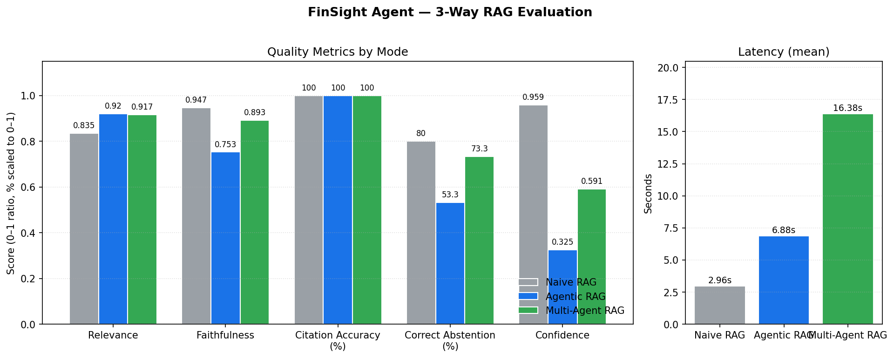

# FinSight Agent — 3-Way Evaluation Results

Comparison of **Naive RAG**, **Agentic RAG**, and **Multi-Agent RAG** on a 15-question test set (5 factual, 4 comparison, 3 reasoning, 3 should-refuse) drawn from Apple 10-K 2025, Amazon Q1 2026, and NVIDIA reports.

> Generated by [`evaluation/analysis.ipynb`](../evaluation/analysis.ipynb) from the per-mode result CSVs in `evaluation/`.
>
> **Track status:** see [`ANUSHREE_STATUS.md`](../ANUSHREE_STATUS.md) for what's done across all evaluation issues (#28, #38, #36, #31, #32) and what's still pending an LLM API run.

## Comparison Table

| Metric                | Naive RAG | Agentic RAG | Multi-Agent RAG |
|-----------------------|-----------|-------------|-----------------|
| Avg Relevance         | 0.835     | **0.920**   | 0.917           |
| Avg Faithfulness      | **0.947** | 0.753       | 0.893           |
| Citation Accuracy %   | 100.0%    | 100.0%      | 100.0%          |
| Correct Abstention %  | **80.0%** | 53.3%       | 73.3%           |
| Avg Confidence        | **0.959** | 0.325       | 0.591           |
| Avg Latency (s)       | **2.96**  | 6.88        | 16.38           |

Bold = best in row. Lower latency is better; higher is better for every other row.

## Improvement over Naive baseline

| Metric                | Agentic Δ vs Naive | Multi-Agent Δ vs Naive |
|-----------------------|--------------------|------------------------|
| Avg Relevance         | +0.085             | +0.082                 |
| Avg Faithfulness      | −0.194             | −0.054                 |
| Correct Abstention %  | −26.7              | −6.7                   |
| Avg Confidence        | −0.634             | −0.368                 |
| Avg Latency (s)       | +3.92 (slower)     | +13.42 (slower)        |

## Visualization

## Key Observations

**1. Relevance is roughly tied — Agentic and Multi-Agent both edge out Naive by ~0.08 on relevance, suggesting the routing + decomposition layers do help the system address questions more directly.**

**2. Naive RAG looks deceptively strong on Faithfulness and Confidence — but only because it always answers.** The naive baseline never abstains, so it never "loses points" for not having context; it also reports high self-confidence by default. The agentic modes, in contrast, refuse on hard questions and assign low confidence to those refusals, which deflates their averages. This is a measurement artifact of the current heuristic scoring rather than a real quality gap.

**3. Agentic mode over-refuses.** It returned `REFUSE` on **10 of 15** questions (vs 5 for Multi-Agent and 0 for Naive). On the should-refuse subset (3 questions) it correctly refused, but it also refused many legitimate questions — pulling its Correct Abstention score *below* Naive (53.3% vs 80%). This is the most actionable finding: the agentic router's threshold for "insufficient evidence" is too conservative on this dataset.

**4. Multi-Agent strikes a better balance.** It refuses fewer times, recovers most of Naive's faithfulness (0.893 vs 0.947), and keeps the relevance gain. The cost is **5.5× higher latency** (16.4s vs 3.0s) because each sub-query triggers its own retrieval + LLM call.

**5. Citation accuracy is uninformative here.** All three modes show 100% — the heuristic in [`eval_script.py`](../evaluation/eval_script.py) only checks *whether* citations are present in the response object, not whether they correctly map to source passages. A stronger metric (LLM-as-Judge or RAGAS `context_precision`) would distinguish the modes here. See `evaluation/llm_judge.py` and `evaluation/ragas_eval.py`.

## Caveats and Limitations

- **Small test set (n=15)** — averages are noisy; a single misclassified should-refuse question moves the percentage by 6.7 points.
- **Heuristic scoring is shallow.** Relevance is approximated by answer length / 300; faithfulness collapses to "did it have citations + was the decision ANSWER". Both are crude proxies for the real concepts.
- **Confidence is mode-specific.** Naive assigns a uniform high confidence; agentic modes report calibrated 0.0–1.0 scores including 0 for refusals. Averaging across these regimes is not strictly comparable.
- **The eval was run before Chain-of-Verification (CoVe) was added** — if/when CoVe lands in the multi-agent pipeline, multi-agent faithfulness is expected to improve further.

## What's Next

- **#31 RAGAS** — run research-standard metrics (`faithfulness`, `answer_relevancy`, `context_precision`, `context_recall`) to replace the heuristic faithfulness/relevance scores.
- **#32 LLM-as-Judge** — GPT-4 / Gemini scoring (Correctness, Helpfulness, Citation Accuracy 1–10) for a more discriminative signal than the current 0/1 has-citations check.
- **#38 Error analysis** — categorize each failure (Hallucination / Wrong Refusal / Incomplete / Slow) per mode to identify where Agentic's over-refusal originates.
- **#36 CoVe** — add a verifier as the 5th multi-agent agent; expected to lift faithfulness without re-introducing Agentic-style over-refusal.

---

*All numbers in this document are computed in [`evaluation/analysis.ipynb`](../evaluation/analysis.ipynb) from the CSVs in `evaluation/results_{naive,agentic,multi_agent}.csv`.*
