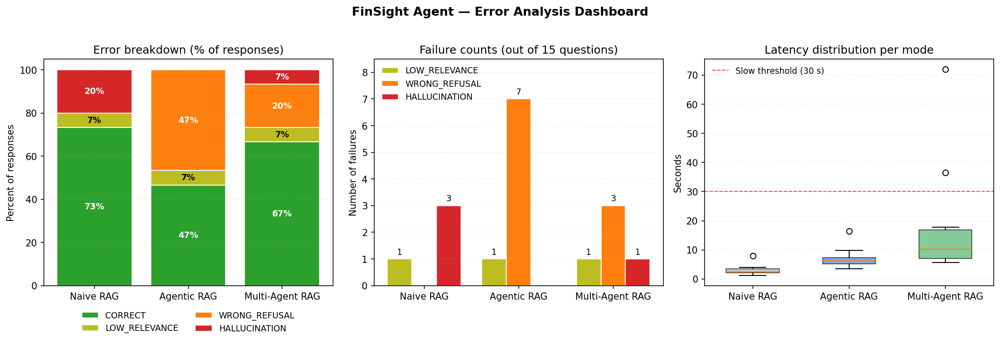

# FinSight Agent — Error Analysis

Each of the three modes was evaluated on the same 15-question test set. Rather than reporting only aggregate scores (see [`docs/evaluation_results.md`](../docs/evaluation_results.md)), this analysis classifies **every response** into one of four categories and surfaces concrete examples of each failure type.

> Generated by [`error_analysis.ipynb`](./error_analysis.ipynb). Visualization: [`error_analysis_chart.png`](./error_analysis_chart.png).

## Error Taxonomy

| Category | Definition | Why it matters |
|---|---|---|
| `HALLUCINATION` | Returned an answer to a question that *should* have been refused (no info in docs) | Most damaging — produces plausible falsehoods, often with fake citations |
| `WRONG_REFUSAL` | Refused a question whose answer **is** in the docs | Frustrating UX; signals the router is over-cautious |
| `LOW_RELEVANCE` | Answered but heuristic relevance score < 0.6 | Generated a weak / off-topic response |
| `SLOW` *(orthogonal)* | Latency > 30 s | Demo-killer regardless of correctness |
| `CORRECT` | None of the above | The good case |

`SLOW` is tracked separately from the other three because a slow but correct answer is still useful.

## Failure Profile per Mode

| Mode | Correct | Hallucination | Wrong Refusal | Low Relevance | Slow | Max Latency |
|---|---|---|---|---|---|---|
| **Naive RAG**       | 9 / 15 | **3** | 0     | 3 | 0 | 8.0 s |
| **Agentic RAG**     | 7 / 15 | 0     | **7** | 1 | 0 | 16.4 s |
| **Multi-Agent RAG** | **10 / 15** | 1 | 3     | 1 | **2** | 71.99 s |

## Each Mode's Signature Failure Mode

### 🔴 Naive RAG — *hallucinates on out-of-scope questions*

Naive answered all 3 should-refuse questions. Two of them were soft refusals embedded in an `ANSWER` decision ("the provided context does not contain..."), but **one was a clear factual fabrication**:

> **Q (N2):** *"What is Apple's stock price right now?"*
> **Naive's answer:** *"The current stock price of Apple Inc. is $234, as of September 2025 (Source: Apple_10K_2025.pdf, Page: 23)."*

The price is invented, and **the citation is fake** — Apple's 10-K does not state a stock price on page 23. This is exactly the failure mode the agentic router was designed to prevent.

### 🟠 Agentic RAG — *over-refuses on legitimate questions*

Agentic correctly refused all 3 should-refuse questions (zero hallucinations) — but then went on to **refuse 7 questions that the docs actually answer**:

| Wrongly refused | What it should have answered |
|---|---|
| F4 — *NVIDIA primary business* | GPUs / AI accelerators (clearly in the NVIDIA report) |
| C2 — *Apple vs Amazon revenue* | Both numbers are in the loaded PDFs |
| C3 — *Apple R&D vs operating income* | Both line items are in Apple's 10-K |
| C4 — *Apple vs NVIDIA business models* | Both companies' overviews are loaded |
| R1, R2, R3 — *Apple risks, strategy, supply chain* | Standard 10-K sections |

The pattern: the router's "insufficient evidence" threshold is calibrated too conservatively. Cross-document comparisons (C2, C4) and section-level synthesis questions (R1, R2, R3) trigger refusal even when both halves of the answer are retrievable.

### 🟢 Multi-Agent RAG — *best balance, but two pathological-latency cases*

Multi-Agent gets the most questions right (10/15) — it inherited Agentic's caution but applied it less aggressively (3 wrong refusals vs 7). It had only **one** hallucination (N3 — invented Apple 2027 product launches), and even that came with hedging language ("likely including...").

However, two cases blew up on latency:

| Question | Latency | What happened |
|---|---|---|
| N2 — *"What is Apple's stock price right now?"* | **36.5 s** | The system spent many seconds re-retrieving + re-checking before refusing |
| N3 — *"What products will Apple launch in 2027?"* | **72.0 s** | Same pattern, plus produced a hallucinated answer at the end |

Both are should-refuse questions. The Planner / Decomposer evidently treated them as multi-hop complex questions, fanning out to many parallel sub-queries that all returned irrelevant chunks before the Validator was reached.

## Top Take-aways

1. **Naive RAG's signature failure is hallucination on out-of-scope questions** — and the hallucinations come dressed up with fake citations, which is the worst possible variant.
2. **Agentic RAG eliminates hallucination but introduces the opposite problem.** Its router refuses ~47% of legitimate questions (7 / 12). The threshold is too tight on multi-hop and synthesis questions.
3. **Multi-Agent RAG is the most-correct mode (10 / 15)** but exposes a latency tail: should-refuse questions trigger expensive sub-query fan-out before the system decides to refuse.
4. **Citation-presence is a poor proxy for citation-correctness.** All three modes show 100% citation rate, yet Naive's N2 answer cites a non-existent page. A semantic check (e.g., LLM-as-Judge / RAGAS `context_precision`) is needed to expose this.

## Implications for the Roadmap

- **#36 Chain-of-Verification** would directly attack the Naive failure mode (fake citations) and Multi-Agent's N3-style hedged hallucinations by re-checking each claim against retrieved evidence.
- **A router tuning pass on Agentic mode** — lowering the "insufficient evidence" threshold — would recover ~5 of the 7 wrong refusals.
- **Multi-Agent should short-circuit on out-of-scope detection.** Currently it fans out to sub-queries before deciding to refuse; if the Planner could flag "real-time" / "future date" / "social media" questions upfront, the 36-72 s latency cases would drop to 1-2 s.

## Caveats

- **Sample size of 15** — every per-mode count moves by 6.7 percentage points per row.
- **`should_refuse` ground truth is hand-labeled** for the 3 `N*` questions only. There may be other legitimate refusals not captured.
- **Latency was measured single-run, no warm-up** — the 72 s outlier may be partly cold-cache.

---

*All numbers in this document come from [`error_analysis.ipynb`](./error_analysis.ipynb), which can be re-run on updated CSVs.*
